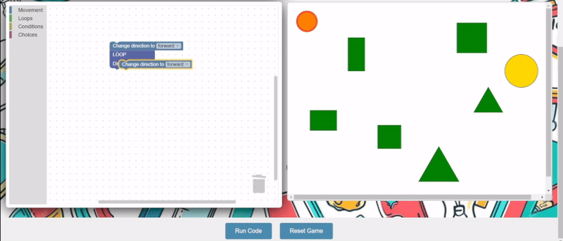

# Interactive Coding Game with Blockly and Two.js

This project teaches kids coding concepts through a visual programming environment. It integrates google's blockly for block combinations and a two.js canvas to display the character.

## Deployment

This application is deployed on [Vercel](https://blockly-game-wheat.vercel.app/).

## Overview

The game provides a simple 2D environment where kids can control an object (e.g., a circle or a robot) using Blockly's drag-and-drop code blocks.  This project demonstrates how to integrate Blockly and Two.js to create an interactive learning experience.

## Blockly and Two.js Interaction

The interaction between Blockly and Two.js is a sophisticated process that enables visual programming:

1. **Block Creation and Code Generation**:
   - Users drag and drop visual code blocks in the Blockly workspace
   - Blockly converts these blocks into executable JavaScript code
   - Custom block generators translate block logic into game commands

2. **Code Execution Mechanism**:
   - When the "Run" button is pressed, the `runCode()` function is triggered
   - Blockly generates JavaScript code from the workspace
   - The code is wrapped in an async function and executed using `eval()`
   - Wrapper functions like `move_forward()` translate block commands into Two.js game actions


## A Simple Winning Combination




## Setup

**Important:**  
This project needs to be served locally using a python web server because Two.js objects may not be sent or rendered correctly if you open the `index.html` file directly in the browser. Please follow the following steps to run it locally using a web server.


1. **Clone the repository**  
   First, clone the repository to your local machine using Git:
   ```bash
   git clone https://github.com/MHuzaifa191/blockly-game.git

2. **Navigate to project directory**  
   ```bash
   cd blockly-game
   ```
3. **Serve the files locally using a web server**  
   ```bash
    python -m http.server 8000
    ```


# Blocks Overview

This project includes several custom Blockly blocks, each representing different actions or control flow in the game. Below is a list of the blocks added, along with the available options for each block:


### 1. **Move in Previous Direction**
   - **Description**: A simple move block that moves the circle in the previous default direction.

### 2. **Move In Direction**
   - **Description**: Overwrites the previous direction to move in the provided direction for a fixed distance.
   - **Available Options**: forward, backward, upward, downward.

### 3. **Loop Until Distance (For Loop)**
   - **Description**: Repeats an action until a specified distance is reached.
   - **Available Options**:
     - `Distance <=`: Input field to specify the target distance.

### 4. **Loop Until Obstacle (While Loop)**
   - **Description**: Repeats an action while an obstacle is detected.

### 5. **Change Direction**
   - **Description**: Changes the direction of movement.
   - **Available Options**:
     - `forward`, `backward`, `upward`, `downward`: Dropdown to select the desired direction.

### 6. **If Condition**
   - **Description**: Performs an action if a certain condition is met, and another action if the condition is false.
   - **Available Options**:
     - `Any Obstacle`: Detects if any obstacle is in front of the character.
     - `Square`, `Circle`, `Rectangle`: Detects specific types of obstacles.

### 7. **Change Color**
   - **Description**: Changes the color of a ball or object in the game.
   - **Available Options**:
     - `Red`, `Green`, `Blue`, `Yellow`: Predefined colors to change the ball's color.


## Technologies Used

* **HTML5:** For structuring the webpage.
* **CSS:** For styling the webpage.
* **JavaScript:** For connecting Blockly to the Two.js game and handling game logic.
* **Blockly:** A visual programming library for creating drag-and-drop code interfaces.
* **Two.js:** A 2D rendering library for canvas and SVG.
